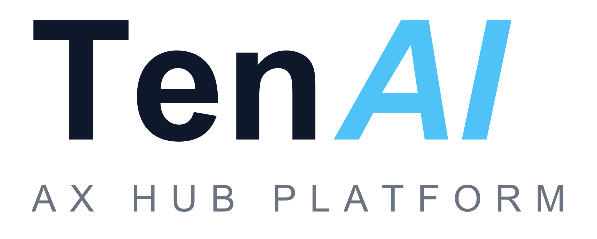

# RuninqVic

<a href="https://www.tenai.kr"></a>

**제작: (주)텐에이아이 · https://www.tenai.kr**

사진 여러 장(그리고 짧은 동영상 클립)과 배경음악만 넣으면 재생시간을 자동으로 배분해 **MP4 동영상**을 만들어 주는 프로그램입니다.
서비스가 종료된 **알씨 동영상 만들기**의 워크플로(간편만들기 → 상세꾸미기 → 만들기)를 그대로 계승하고,
비트 싱크·세로 영상·4K·자동 저장 같은 기능을 더했습니다.

## 바로 사용하기
- 웹: **https://runinqvic.vercel.app** (Edge/Chrome, 설치 불필요) · 스마트폰(안드로이드 Chrome, iOS Safari 16.4+)에서도 같은 주소로 사용, 홈 화면에 추가하면 앱처럼 실행
- 소스: https://github.com/SamulChung/RuninqVic
- 사용설명서: https://runinqvic.vercel.app/manual (Word 버전: `docs/manual/RuninqVic_사용설명서.docx`)

## PC에서 실행
1. `RuninqVic.bat` 을 더블클릭합니다. (Edge 또는 Chrome 이 앱 창으로 열립니다)
2. 또는 `index.html` 을 Edge/Chrome 으로 엽니다.

설치, 인터넷 연결, 계정이 필요 없습니다. 사진과 음악은 PC 밖으로 나가지 않습니다.

## 사용법
| 단계 | 할 일 |
|---|---|
| 1 | **사진·동영상 추가** 또는 화면에 끌어다 놓기 (JPG/PNG/WEBP, MP4/WEBM/MOV, EXIF 회전 자동) |
| 2 | **배경음악** 넣기 (MP3/M4A/WAV/OGG, 여러 곡 가능) 또는 **AI** 버튼에서 기본 제공 음악 3곡(키 불필요)을 쓰거나 가사·분위기를 적어 ElevenLabs로 새 곡 생성 |
| 3 | 장당 재생시간 입력, 또는 *음악 재생시간에 균등하게 맞춤* / *비트에 맞춰 자동 전환* |
| 4 | 오프닝·엔딩 제목 확인 |
| 꾸미기 | 자막 · 디자인(배경 20종, 액자 10종) · 효과(전환 12종, 시네마틱 7종) · 동영상 구간 자르기/소리 조절 |
| 만들기 | **동영상 만들기** → 크기(720p~4K)·프레임(24/30/60)·품질 선택 → MP4 저장 |
| 보내기 | 완성 화면의 **카카오톡 등으로 보내기**(휴대폰 공유 창) · PC는 파일 아이콘을 카카오톡 채팅창으로 끌어다 놓기 · 위쪽 📤 버튼으로 다시 열기 |

작업 내용은 브라우저 안에 자동 저장되어 다시 열면 이어서 할 수 있고, **저장** 버튼으로 `.rvproj` 파일을 만들어 다른 PC로 옮길 수 있습니다.

## 기술
- 순수 HTML/CSS/JS, 빌드 도구 없음. `js/` 아래 모듈:
  `state`(모델) · `timeline`(시간 배분) · `designs`(프리셋) · `render`(캔버스 렌더러) · `audio`(믹스/비트 검출) · `exporter`(WebCodecs) · `store`(IndexedDB/.rvproj) · `app`(UI)
- 인코딩: WebCodecs `VideoEncoder`(H.264, GPU 가속) + `AudioEncoder`(AAC) → `mp4-muxer`. H.264 를 못 쓰는 환경은 VP9/Opus WebM 으로 자동 대체.
- 미리보기와 결과물이 같은 렌더러를 쓰므로 화면에서 본 그대로 저장됩니다.
- 모바일: 900px 이하에서 세로 레이아웃(미리보기 → 타임라인 → 작업 패널), `navigator.share`로 갤러리·카톡 저장, `manifest.json` + `sw.js`(네트워크 우선, 오프라인 폴백)로 PWA 설치.
- 동영상 클립: `<video>` 요소를 내보내기 전용 복제본으로 실시간 재생하며 프레임을 캡처(`Renderer.prepare` export 모드). 클립 소리는 `decodeAudioData`로 디코딩해 오프라인 믹스에 합치고, 재생 중 배경음악을 자동으로 낮춥니다(더킹).

## AI 작곡 서버 키 설정 (운영자 · 강의용)
`api/music.js`(Vercel 서버리스 함수)가 ElevenLabs 호출을 대신 해 줍니다. 운영자 키를 서버에 등록하면 수강생은 키 없이 작곡할 수 있습니다.

**가장 쉬운 방법:** `강의설정.bat` 더블클릭 → 창에 키·강의 코드·관리자 코드 입력 → [저장하고 사이트에 반영]. (이 PC에서 Vercel 로그인이 안 되어 있으면 도구가 `vercel login` 창을 열어 브라우저 승인을 받음, 키는 파일에 남지 않고 `vercel env add`의 표준 입력으로만 전달)

| 환경 변수 | 뜻 |
|---|---|
| `ELEVENLABS_API_KEY` | 운영자 키. 등록하면 방문자가 키 없이 작곡 가능 (요금은 키 소유자 부담) |
| `LECTURE_CODE` | 이 코드를 넣은 요청만 운영자 키 사용. 코드가 없으면 운영자 키는 꺼진 상태로 취급(fail closed) |
| `LECTURE_OPEN` | (선택) `1`이면 코드 없이 누구나 운영자 키 사용(공개 모드, 비권장) |
| `ADMIN_CODE` | (선택) 도움말 › 사용량(운영자) 화면을 여는 코드 |
| `LECTURE_MAX_SECONDS` | (선택, 기본 120) 운영자 키로 만드는 곡의 최대 길이 |
| `LECTURE_RATE_PER_10MIN` | (선택, 기본: 강의 코드 사용 시 60 · 공개 모드 6) 같은 IP에서 10분 동안 만들 수 있는 곡 수. 별도로 브라우저당 10분 5곡, 잘못된 코드 10분 40회 제한 |

사용량 화면은 도움말 창 맨 아래의 [📊 사용량(운영자)] 버튼 또는 `https://runinqvic.vercel.app/#usage` 주소로 엽니다. ElevenLabs의 `GET /v1/user/subscription`, `GET /v1/usage/character-stats`를 서버에서 호출해 보여 줍니다(키에 사용량 조회 권한 필요). 강의가 끝나면 도구의 [강의 종료]로 키를 내리세요(키와 `LECTURE_OPEN`만 지우고 코드는 유지). 도구는 설정을 바꾼 뒤 `vercel redeploy runinqvic.vercel.app --target production`으로 서비스 중인 버전을 다시 배포하므로 로컬 폴더의 파일은 올라가지 않습니다.

서버 키로는 `POST /v1/music/plan`, `POST /v1/music` 두 호출만 중계하며(JSON·동일 출처 요청만), 곡 길이는 서버에서 강제로 줄입니다. 운영자 키에서 난 오류(크레딧 부족 등)는 내용을 숨기고 "강사에게 알려 주세요"로만 안내합니다.

## 기본 제공 음악
`assets/music/` 에 기본 제공 음악 파일 3곡(봄의 첫빛 2곡, Rosemarine)이 들어 있고, `js/musicgen.js`의 `builtinSong(...)` 항목으로 등록되어 있습니다. 곡을 바꾸려면 파일을 교체하고 그 항목의 제목·경로·길이를 고치면 됩니다.

## 사용설명서 다시 만들기
스크린샷은 `docs/manual/img/`, 본문은 `docs/manual/content.js` 에 있습니다.
```
NODE_PATH=<docx 패키지가 설치된 node_modules> node docs/manual/build-manual.js
```

## 테스트
```
node tests/timeline.test.js
node tests/musicgen.test.js
node tests/proxy.test.js
```
